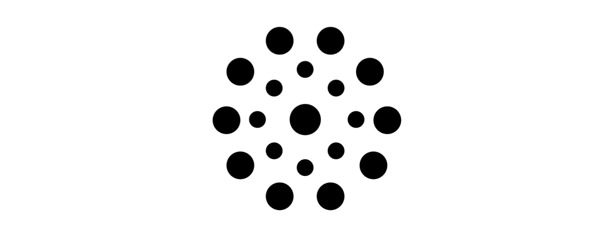
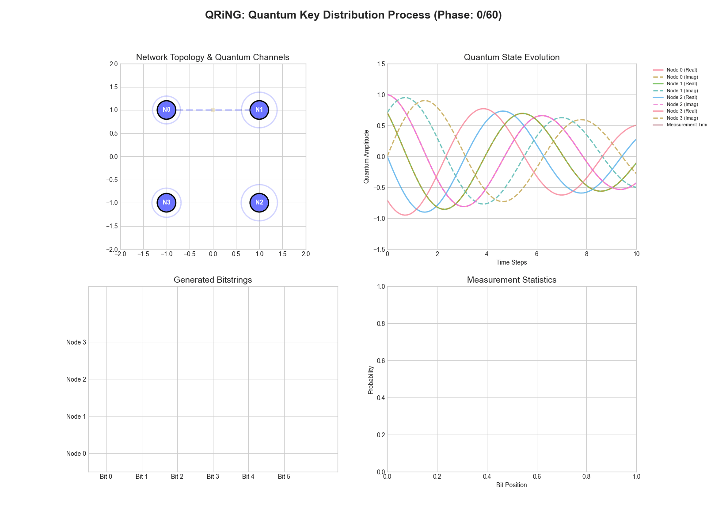
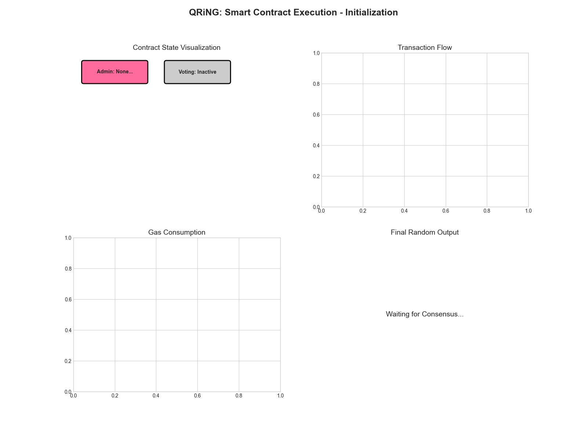
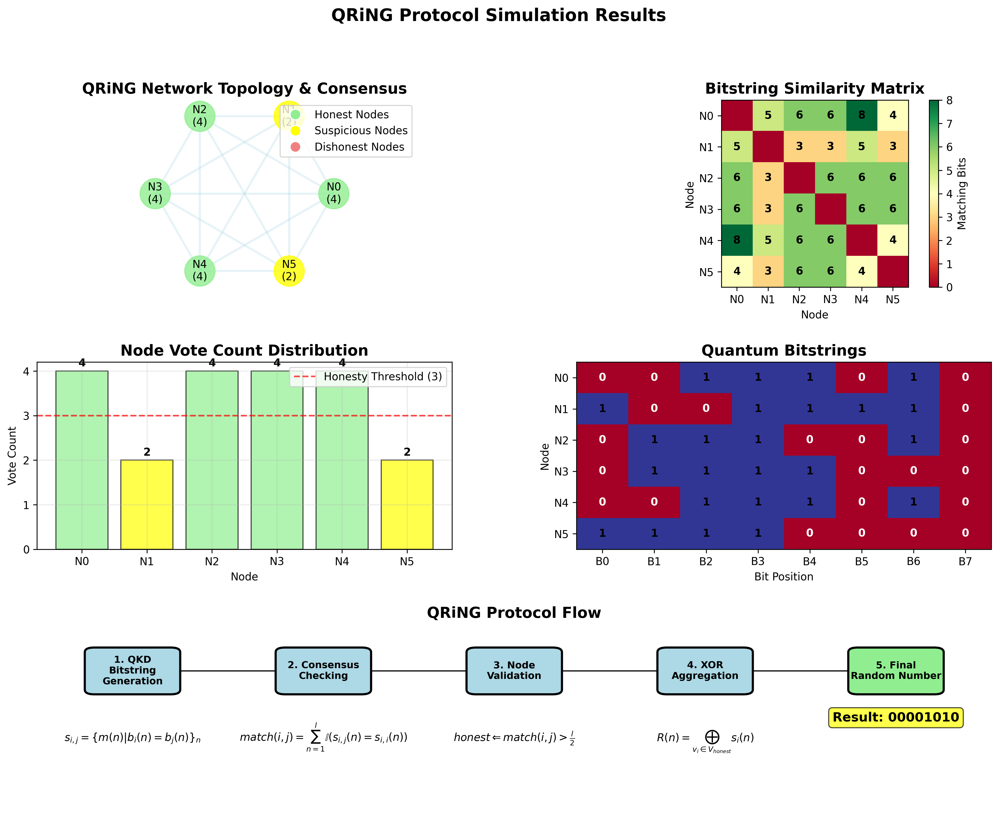
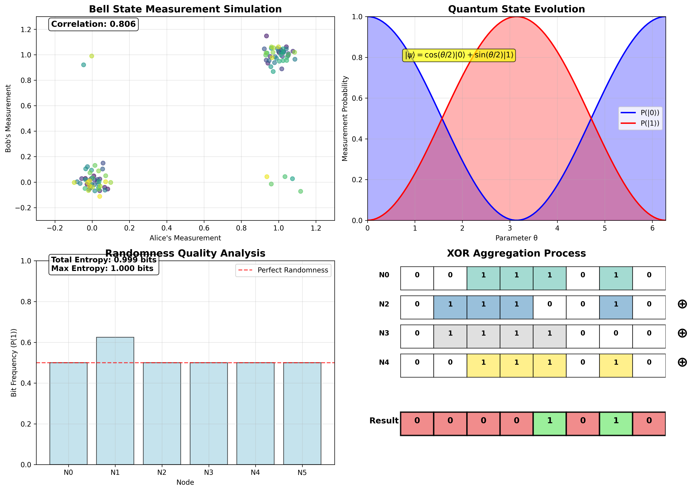
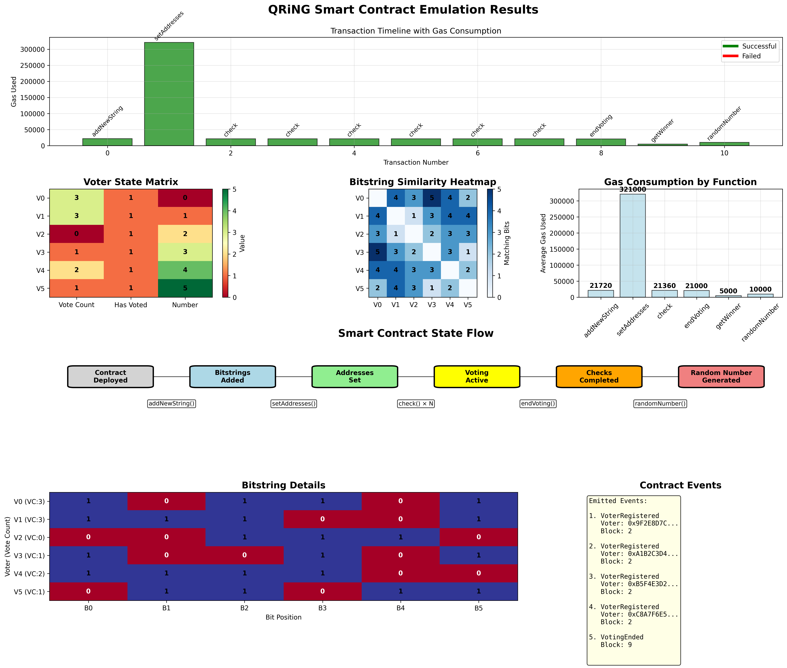

# QRiNG: Quantum Random Number Generator Protocol
###### Verifiable quantum random number generation using Ethereum smart contracts and QKD.

<p align="center">
  <a href="https://github.com/btq-ag/QRiNG/actions/workflows/ci.yml"></a>
  <a href="https://www.python.org/downloads/"></a>
  <a href="LICENSE"></a>
  <a href="pyproject.toml"></a>
</p>



## Objective

QRiNG generates verifiable quantum random numbers by combining QKD bitstring generation with on-chain majority-vote consensus. Built at BTQ by Jeffrey Morais. 58 tests across simulator and emulator, CI on Python 3.10, 3.11, 3.12.

The repository contains a Qiskit-based QRNG simulator, a Python emulator that replicates the Solidity contract logic, and an animated visualization suite. Participants submit quantum-generated bitstrings to an Ethereum smart contract, validators run pairwise correlation checks, and honest nodes are identified by majority vote. The final random output is the XOR aggregate of all honest bitstrings.

The protocol exploits the fundamental indeterminacy of quantum measurement. For a qubit prepared in superposition state |ψ⟩ = α|0⟩ + β|1⟩ (where |α|² + |β|² = 1), measurement outcomes are governed by Born's rule:

$$P(|i\rangle) = |\langle i|\psi\rangle|^2$$

For an equal superposition (α = β = 1/√2), this yields maximum entropy $H = -\sum_{i} P_i \log_2 P_i = 1$ bit. The quantum mechanical origin of this randomness is fundamentally different from classical pseudo-random number generators (PRNGs), which rely on deterministic algorithms. Quantum randomness satisfies the min-entropy bound $H_{\min}(X) \geq n$ for $n$ independent qubit measurements, providing information-theoretic security guarantees.

The goal is to demonstrate a complete quantum random number generation ecosystem that combines quantum physics principles with blockchain technology to create verifiable, distributed, and cryptographically secure random numbers for applications requiring high-entropy randomness.

## Theoretical Background

### Quantum Key Distribution (QKD) Foundation

The QRiNG protocol builds upon the BB84 quantum key distribution protocol, where quantum states are prepared in superposition and measured to generate random bitstrings. Qubits are initialized in one of two conjugate bases: the computational basis {|0⟩, |1⟩} or the Hadamard basis {|+⟩, |−⟩}. These bases are related by the Hadamard gate $H$, a unitary transformation defined as:

$$H = \frac{1}{\sqrt{2}} \begin{pmatrix} 1 & 1 \\\ 1 & -1 \end{pmatrix}$$

Applying $H$ to the computational basis states yields |+⟩ = (|0⟩ + |1⟩)/√2 and |−⟩ = (|0⟩ − |1⟩)/√2. When measuring a state prepared in one basis using the conjugate basis, the Heisenberg uncertainty principle guarantees randomness. For example, measuring |0⟩ in the Hadamard basis yields $P(+) = P(-) = 1/2$, producing a perfectly random bit.

Security derives from the quantum no-cloning theorem, which states that no physical process can duplicate an arbitrary quantum state. Any eavesdropping attempt necessarily disturbs the quantum channel, introducing a detectable error rate ε ≥ 1/4 per intercepted qubit.

### Blockchain Consensus Integration

The protocol extends traditional QKD by incorporating blockchain consensus mechanisms. Participants first commit their quantum measurement results to the blockchain via cryptographic hash $h = \text{SHA3}(\mathbf{b}_i || \text{nonce})$, ensuring commitment before revelation. Multiple validators then verify measurement consistency through pairwise bitstring correlation, after which final random numbers are extracted from validated measurements using XOR aggregation. All quantum randomness generation events are permanently recorded on-chain with timestamp $t$ and block number $B$, providing an immutable audit trail.

### Mathematical Formulation

The quantum bitstring generation process begins with $n$ independent qubits, each prepared in equal superposition and measured. The joint probability distribution over all $2^n$ possible outcomes is uniform:

$$P(\mathbf{b}) = \prod_{i=1}^{n} P(b_i) = \frac{1}{2^n}$$

where $\mathbf{b} = (b_1, b_2, ..., b_n) \in \{0,1\}^n$ is the measured bitstring, satisfying the maximum entropy condition $H(\mathbf{b}) = n$ bits.

To validate measurements across the network, we define a similarity metric between bitstrings. For two bitstrings $\mathbf{b}_i$ and $\mathbf{b}_j$ of length $\ell$, the similarity score counts matching positions:

$$S(\mathbf{b}_i, \mathbf{b}_j) = \sum_{k=1}^{\ell} \mathbb{1}[b_i^{(k)} = b_j^{(k)}] = \ell - d_H(\mathbf{b}_i, \mathbf{b}_j)$$

where $d_H$ denotes the Hamming distance. Honest nodes with correlated quantum sources are expected to achieve $S > \ell/2$, while adversarial or faulty nodes will exhibit lower similarity due to uncorrelated random guessing.

The consensus mechanism classifies node $i$ as honest when $\text{VoteCount}(i) > |V|/2$, where $|V|$ is the total validator count. The final random output is then computed via bitwise XOR aggregation over all honest nodes:

$$R[k] = \bigoplus_{i \in V_{\text{honest}}} b_i^{(k)} \pmod{2}, \quad k = 1, \ldots, \ell$$

This construction preserves entropy: if at least one honest node contributes true quantum randomness, the output maintains full cryptographic security regardless of adversarial behavior from other participants.

## Code Functionality

### Installation

```bash
pip install -e .
```

Or with development dependencies (includes Qiskit Aer for true quantum simulation):

```bash
pip install -e ".[dev]"
```

To install only the quantum backend without dev tools:

```bash
pip install -e ".[quantum]"
```

### 1. Quantum Random Number Generation and Simulation
The `qring/simulator.py` implements the complete QKD simulation with network consensus. When `qiskit-aer` is installed, each node generates bitstrings by applying Hadamard gates to qubits in the $|0\rangle$ state and measuring on `AerSimulator`, producing genuine quantum randomness. A classical PRNG fallback is available when Qiskit is not installed. The simulator also tracks vote counts and identifies honest nodes through the consensus protocol.

```python
class QRiNGSimulator:
    def __init__(self, numNodes=6, bitstringLength=8, seed=None,
                 useQuantumBackend=None, consensusThreshold=None):
        self.rng = np.random.default_rng(seed)  # Instance-level RNG (no global state mutation)
        if useQuantumBackend is None:
            self.useQuantumBackend = _HAS_QISKIT  # Auto-detect Qiskit availability
        self.numNodes = numNodes
        self.bitstringLength = bitstringLength
        self.consensusThreshold = consensusThreshold if consensusThreshold is not None else bitstringLength // 2
        self.bitstrings = {}
        self.voteCounts = np.zeros(numNodes)
        self.honestNodes = []
        self._generateQuantumBitstrings()
    
    def calculateBitstringSimilarity(self, node1, node2):
        """Calculate similarity between two nodes' bitstrings"""
        matches = np.sum(self.bitstrings[node1] == self.bitstrings[node2])
        return matches
```

### 2. Blockchain Smart Contract Emulation
The `qring/emulator.py` replicates Ethereum smart contract functionality in Python, enabling testing and validation without deployment costs. The emulator maintains complete contract state including voter registrations, bitstring storage, voting status, and vote tallies. Gas costs follow the Ethereum model: $G_{\text{total}} = G_{\text{base}} + n \cdot G_{\text{voter}} + n \cdot \ell \cdot G_{\text{storage}}$ where $G_{\text{base}} = 21000$, $G_{\text{voter}} \approx 50000$, and $G_{\text{storage}} \approx 20$ per bit. Transaction logging provides a complete audit trail for debugging and verification.

```python
class QRiNGEmulator:
    def __init__(self, bitstringLength=6, adminAddress=None, consensusThreshold=None):
        self.voters = []             # Array of Voter structs
        self.admin = adminAddress    # Set in constructor (mirrors Solidity constructor)
        self.votingActive = False    # Voting phase flag
        self.initialized = False     # Guard against re-initialization
        self.counter = []            # 2D array for bitstrings
        self.consensusThreshold = consensusThreshold if consensusThreshold is not None else bitstringLength // 2
        self.transactionLog = []     # Complete audit trail
        self.gasConsumption = {}     # Gas tracking per function
    
    def addNewString(self, newString, callerAddress):
        """Store quantum bitstrings in contract storage (admin only)"""
        if callerAddress != self.admin:
            raise Exception("Only admin can call this function")
        gasUsed = 21000 + len(newString) * len(newString[0]) * 20
        self.counter = [list(bitstring) for bitstring in newString]
        self._logTransaction('addNewString', callerAddress, gasUsed)
        return True
```

### 3. Consensus Mechanism Implementation
The protocol implements majority-vote consensus for validating quantum measurements and identifying honest participants. Each node computes pairwise similarity scores $S_{ij} = \sum_{k=1}^{\ell} \mathbb{1}[b_i^{(k)} = b_j^{(k)}]$ against all other nodes. When $S_{ij}$ exceeds a configurable `consensusThreshold` (default $\ell/2$), the checking node casts a vote for the target as honest. After all validations complete, nodes with $\text{VoteCount} > n/2$ are classified as honest. The final random output $R = \bigoplus_{j \in V_{\text{honest}}} \mathbf{b}_j$ preserves full entropy if at least one honest node contributes true quantum randomness.

```python
def performConsensusCheck(self, checking_node):
    """Execute consensus validation from one node's perspective"""
    if self.hasVoted[checking_node]:
        return False
    
    threshold = self.consensusThreshold
    for target_node in self.nodes:
        if target_node != checking_node:
            matches = self.calculateBitstringSimilarity(checking_node, target_node)
            if matches > threshold:
                self.voteCounts[target_node] += 1
    
    self.hasVoted[checking_node] = True
    return True

def generateFinalRandomNumber(self):
    """XOR aggregate honest nodes' bitstrings"""
    finalBits = np.zeros(self.bitstringLength, dtype=int)
    for node in self.honestNodes:
        finalBits = finalBits ^ self.bitstrings[node]
    return finalBits
```

### 4. Visualization Suite
The `qring/visualization.py` creates animated GIF visualizations demonstrating the protocol lifecycle. Network topology renders nodes in circular layout with color-coded consensus status (green = honest, red = dishonest). Animations cover QKD bitstring exchange, pairwise consensus voting, smart contract transaction flow, and a side-by-side comparison of the simulator and emulator outputs.

```python
class QRiNGVisualizer:
    def __init__(self, outputDir="../Plots"):
        self.outputDir = outputDir
        self.colors = {
            'quantum': '#6B73FF',
            'honest': '#00FF88', 
            'dishonest': '#FF6B6B',
            'active': '#FFD93D'
        }
    
    def animateQkdProcess(self, savePath):
        """Animate quantum key distribution between network nodes"""
        simulator = QRiNGSimulator(numNodes=4, bitstringLength=6, seed=42)
        fig, axes = plt.subplots(2, 2, figsize=(16, 12))
        # ... animation logic for 60 frames at 8 FPS
    
    def generateAllAnimations(self):
        """Generate complete animation suite"""
        self.animateQkdProcess("qkd_process.gif")
        self.animateConsensusMechanism("consensus_mechanism.gif")
        self.animateSmartContractExecution("smart_contract_execution.gif")
```

### 5. Smart Contract Integration
The integration demonstrates the complete protocol lifecycle across five phases, each with specific gas costs and cryptographic guarantees. Phase 1 uploads quantum bitstrings ($G \approx 25,000$ gas), Phase 2 registers voter addresses ($G \approx 50,000n$), Phase 3 executes pairwise consensus checks ($G \approx 5,000n^2$), Phase 4 terminates voting, and Phase 5 extracts the final random number via XOR aggregation. Contract events `VoterRegistered` and `VotingEnded` enable off-chain monitoring and provide cryptographic attestation of each protocol step.

```python
# Complete protocol execution demonstrating full lifecycle
def runFullProtocol(bitstrings, addresses, admin):
    emulator = QRiNGEmulator(bitstringLength=6, adminAddress=admin)
    
    # Phase 1: Upload quantum-generated bitstrings (admin only)
    emulator.addNewString(bitstrings, admin)
    
    # Phase 2: Register participant addresses (admin only, one-time)
    emulator.setAddresses(addresses, admin)
    
    # Phase 3: Execute pairwise consensus validation
    for i, addr in enumerate(addresses):
        emulator.check(i, addr)
    
    # Phase 4: Terminate voting phase
    emulator.endVoting(admin)
    
    # Phase 5: Extract final quantum random number
    randomBits = emulator.randomNumber(admin)
    return randomBits
```

## Results

The following visualizations are generated by the simulator, emulator, and visualization suite.

### Quantum Measurement Process



The QKD animation shows the quantum random number generation pipeline. Qubits are initialized in equal superposition |+⟩ = (|0⟩ + |1⟩)/√2, yielding measurement probabilities $P(0) = P(1) = 0.5$. When Qiskit Aer is installed, bitstrings are generated via actual Hadamard + measure circuits on `AerSimulator`; otherwise a seeded PRNG fallback is used.

### Smart Contract Execution



The emulator animation demonstrates the full transaction lifecycle: bitstring upload, voter registration, pairwise consensus checks, voting termination, and random number extraction. Gas costs are estimated per the Ethereum model (base 21,000 + per-voter and per-bit storage costs). The emulator logs every transaction with function name, caller, gas, and success/failure.

### Static Visualization Results



Network topology visualization showing consensus results for a 6-node simulation. Green nodes passed majority-vote validation ($\text{VoteCount} > n/2$); red nodes did not. The similarity heatmap displays pairwise Hamming-distance-based correlation scores.



Bitstring analysis plots: per-node bit frequency, quantum state evolution curves, and XOR aggregation step-by-step breakdown. Correlation scatter uses classically simulated paired measurements with configurable noise.



Emulator execution analysis: gas consumption per function call, voter state matrix, bitstring similarity heatmap, and contract event log. The pairwise validation phase scales at $O(n^2)$.

## Smart Contract Integration

The protocol is built around the `contracts/originalQRiNG.sol` Ethereum smart contract. Admin is set at deployment via the constructor. Access control modifiers protect `addNewString` and `setAddresses`, and a one-time initialization guard prevents re-registration attacks. A configurable `consensusThreshold` allows tuning the correlation requirement before initialization.

```solidity
pragma solidity ^0.8.0;

contract QRiNG {
    struct Voter {
        address delegate;
        bool hasVoted;
        uint number;
        uint voteCount;
        uint[] bitstring;
    }

    Voter[] public voters;
    address public admin;
    bool public votingActive;
    uint[][] public counter;
    bool private initialized;
    uint public consensusThreshold;

    modifier onlyAdmin() {
        require(msg.sender == admin, "Only admin can call this function");
        _;
    }

    constructor() {
        admin = msg.sender;
    }

    function setConsensusThreshold(uint threshold) external onlyAdmin {
        require(!initialized, "Cannot change threshold after initialization");
        consensusThreshold = threshold;
    }

    function addNewString(uint[][] memory newString) public onlyAdmin {
        counter = newString;
    }

    function setAddresses(address[] memory voterAddresses) public onlyAdmin {
        require(!initialized, "Already initialized");
        initialized = true;
        votingActive = true;
        for (uint x = 0; x < voterAddresses.length; x++) {
            voters.push(Voter({
                delegate: voterAddresses[x],
                hasVoted: false,
                number: x,
                voteCount: 0,
                bitstring: counter[x]
            }));
        }
    }

    function randomNumber() external view returns (uint[] memory) {
        require(!votingActive, "Voting is still active");
        require(voters.length > 0, "No voters registered");
        uint256 len = voters.length / 2;
        uint bitstringLength = voters[0].bitstring.length;
        uint[] memory newBitstring = new uint[](bitstringLength);
        for (uint i = 0; i < voters.length; i++) {
            if (voters[i].voteCount > len) {
                for (uint x = 0; x < voters[i].bitstring.length; x++) {
                    newBitstring[x] ^= voters[i].bitstring[x];
                }
            }
        }
        return newBitstring;
    }
}
```

## Project Structure

```
qring/
  __init__.py          # Package exports
  simulator.py         # QKD simulation + consensus
  emulator.py          # Solidity contract emulation
  visualization.py     # Animated GIF generation
contracts/
  originalQRiNG.sol    # Ethereum smart contract
tests/
  test_simulator.py    # 27 simulator tests
  test_emulator.py     # 31 emulator tests
examples/
  exampleSimulation.py # Basic simulation demo
  exampleEmulation.py  # Emulator demo
```

## Caveats

- This implementation simulates ideal quantum measurements; real quantum devices introduce noise, decoherence, and measurement errors requiring additional error correction.

- The consensus mechanism assumes honest majority and is optimized for small networks (< 100 participants). Production deployment would require gas optimization and layer-2 scaling solutions.

- True quantum security guarantees require genuine quantum hardware; classical simulation provides educational and prototyping value but not information-theoretic security.

## Next Steps

- [ ] Implement error correction codes for noisy quantum channels
- [ ] Add Byzantine fault tolerance to the consensus mechanism  
- [x] Integrate with Qiskit Aer for genuine quantum circuit simulation
- [ ] Integrate with actual quantum hardware via cloud APIs (IBM Quantum, Google Quantum AI)
- [ ] Develop layer-2 scaling solutions for large participant networks
- [ ] Implement zero-knowledge proofs for enhanced privacy
- [ ] Add formal verification of smart contract security properties
- [ ] Create mobile app interface for quantum randomness consumption

> [!NOTE]
> This implementation serves as both a research prototype and educational tool for understanding quantum-blockchain integration. Production deployment requires additional security auditing and hardware optimization.

> [!IMPORTANT]
> The quantum randomness generated by this protocol is cryptographically secure only when implemented with genuine quantum hardware. Classical simulation provides educational value but not true quantum security guarantees.

---

*© 2024-2026 BTQ Technologies, MIT License*
